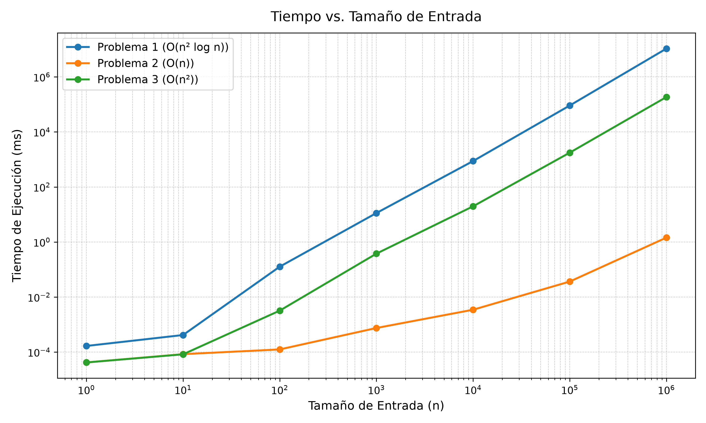

# CC2019-LAB8

Análisis de algoritmos. El propósito del laboratorio es analizar y comparar cómo crece el tiempo de ejecución de tres algoritmos con distintas complejidades: `O(n² log n)`, `O(n)` y `O(n²)`.

## Descripción

Se implementaron los algoritmos en C++, un programa de *benchmark* que mide sus tiempos para diferentes tamaños de entrada y exporta los resultados a un archivo CSV. Finalmente, un script en Python genera una gráfica en escala logarítmica para comparar el comportamiento experimental con el análisis teórico.

## 1. Ejecutar

```bash
clang++ -std=c++17 -O2 main.cpp -o main
./main
```

## 2. Gráficar

```bash
docker compose run --rm plotter
```

## 3. Resultados

Tiempos de ejecución medidos en milisegundos:

| n | Problema 1 | Problema 2 | Problema 3 |
|---:|-----------:|-----------:|-----------:|
| 1 | 0.000167 | 0.000042 | 0.000042 |
| 10 | 0.000417 | 0.000084 | 0.000083 |
| 100 | 0.126917 | 0.000125 | 0.003209 |
| 1,000 | 11.2637 | 0.000750 | 0.377208 |
| 10,000 | 872.629 | 0.003458 | 19.7991 |
| 100,000 | 90,983.5 | 0.036542 | 1,763.38 |
| 1,000,000 | 10,651,100 | 1.44413 | 185,115 |



**Enlace al video de ejecución**: <https://youtu.be/nkSnOaPbpj8>
